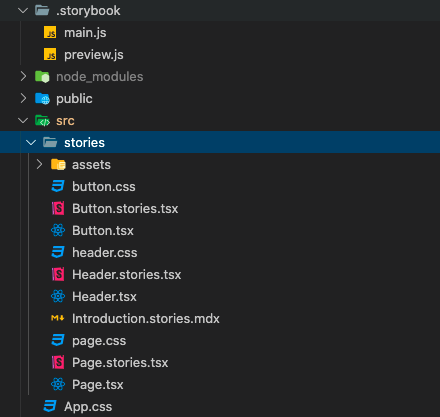

# Configure React with TypeScript, ESLint, Prettier and Storybook

## Table of Contents

  - [Make sure you run Node.js v10+](#make-sure-you-run-nodejs-v10)
  - [Use `Create React App` (CRA) and create a TypeScript supported React app](#use-create-react-app-and-create-a-typescript-supported-react-app)
  - [Organise some devDependencies (optional - personal thing for me)](#organise-some-devdependencies-optional---personal-thing-for-me)
  - [Configure `eslint`](#configure-eslint)
    - [Other GitHub resources](#other-github-resources)
  - [Configure Prettier](#configure-prettier)
    - [Integrate ESLint and Prettier](#integrate-eslint-and-prettier)
  - [Add eslint-plugin-react-hooks linting rules](#add-eslint-plugin-react-hooks-linting-rules)
    - [React hooks rules with eslint-plugin](#react-hooks-rules-with-eslint-plugin)
  - [Configure Storybook](#configure-storybook)
  - [Thanx](#thanx)

---

### Make sure you run Node.js v10+

To install check ([Node.js installation](https://nodejs.org/en/) or [Node Version Manager installation](https://github.com/nvm-sh/nvm)).

### Use `Create React App` and create a TypeScript supported React app

Facebook's create-react-app: [CRA](https://github.com/facebook/create-react-app)

```
npx create-react-app create-react-app-with-typescript-template --template typescript
```

### Organise some devDependencies (optional - personal thing for me)

package.json:

```
...
 "dependencies": {
    "react": "^16.13.1",
    "react-dom": "^16.13.1",
    "react-scripts": "3.4.3"
  },
  "devDependencies": {
    "@testing-library/jest-dom": "^4.2.4",
    "@testing-library/react": "^9.3.2",
    "@testing-library/user-event": "^7.1.2",
    "@types/jest": "^24.0.0",
    "@types/node": "^12.0.0",
    "@types/react": "^16.9.0",
    "@types/react-dom": "^16.9.0",
    "typescript": "^4.0.3"
  }
...
```

### Configure `eslint`

(Note: I had to restart VSCode before the linting rules showed up in my `.ts/.tsx` files.)

You'll need a `.eslintrc.js` file.

```
npx eslint --init
```

Output:

```
? How would you like to use ESLint? …
  To check syntax only
❯ To check syntax and find problems
  To check syntax, find problems, and enforce code style

✔ How would you like to use ESLint? · problems

? What type of modules does your project use? …
❯ JavaScript modules (import/export)
  CommonJS (require/exports)
  None of these
✔ What type of modules does your project use? · esm

? Which framework does your project use? …
❯ React
  Vue.js
  None of these
✔ Which framework does your project use? · react

? Does your project use TypeScript? › No / Yes
✔ Does your project use TypeScript? · Yes

? Where does your code run? …  (Press <space> to select, <a> to toggle all, <i> to invert selection)
✔ Browser
✔ Node
✔ Where does your code run? · browser

? What format do you want your config file to be in? …
❯ JavaScript
  YAML
  JSON
✔ What format do you want your config file to be in? · JavaScript

eslint-plugin-react@latest @typescript-eslint/eslint-plugin@latest @typescript-eslint/parser@latest
? Would you like to install them now with npm? › No / Yes

The config that you've selected requires the following dependencies:
eslint-plugin-react@latest @typescript-eslint/eslint-plugin@latest @typescript-eslint/parser@latest eslint@latest

Installing eslint-plugin-react@latest, @typescript-eslint/eslint-plugin@latest, @typescript-eslint/parser@latest, eslint@latest
npm WARN eslint-config-react-app@5.2.1 requires a peer of @typescript-eslint/eslint-plugin@2.x but none is installed. You must install peer dependencies yourself.
npm WARN eslint-config-react-app@5.2.1 requires a peer of @typescript-eslint/parser@2.x but none is installed. You must install peer dependencies yourself.
npm WARN eslint-config-react-app@5.2.1 requires a peer of eslint@6.x but none is installed. You must install peer dependencies yourself.
npm WARN eslint-loader@3.0.3 requires a peer of eslint@^5.0.0 || ^6.0.0 but none is installed. You must install peer dependencies yourself.
npm WARN eslint-plugin-import@2.20.1 requires a peer of eslint@2.x - 6.x but none is installed. You must install peer dependencies yourself.
npm WARN eslint-plugin-jsx-a11y@6.2.3 requires a peer of eslint@^3 || ^4 || ^5 || ^6 but none is installed. You must install peer dependencies yourself.
npm WARN eslint-plugin-react-hooks@1.7.0 requires a peer of eslint@^3.0.0 || ^4.0.0 || ^5.0.0 || ^6.0.0 but none is installed. You must install peer dependencies yourself.

+ eslint@7.11.0
+ @typescript-eslint/parser@4.4.0
+ @typescript-eslint/eslint-plugin@4.4.0
+ eslint-plugin-react@7.21.4
removed 10 packages, updated 4 packages and audited 2010 packages in 12.394s

78 packages are looking for funding
  run `npm fund` for details

found 0 vulnerabilities

Warning: React version not specified in eslint-plugin-react settings. See https://github.com/yannickcr/eslint-plugin-react#configuration .
Successfully created .eslintrc.js file in /Users/ruanbeukes/repos/React-storybook-template/create-react-app-with-typescript-template
ESLint was installed locally. We recommend using this local copy instead of your globally-installed copy.
```

Now there will be a`.eslintrc.js` file:

```
module.exports = {
    "env": {
        "browser": true,
        "es2021": true
    },
    "extends": [
        "eslint:recommended",
        "plugin:react/recommended",
        "plugin:@typescript-eslint/recommended"
    ],
    "parser": "@typescript-eslint/parser",
    "parserOptions": {
        "ecmaFeatures": {
            "jsx": true
        },
        "ecmaVersion": 12,
        "sourceType": "module"
    },
    "plugins": [
        "react",
        "@typescript-eslint"
    ],
    "rules": {
    }
};
```

How to fix warning:

> Warning: React version not specified in eslint-plugin-react settings. See https://github.com/yannickcr/eslint-plugin-react#configuration.

edit `.eslintrc.js` with:

```
...
  "settings": {
        "react": {
          "pragma": "React",
          "version": "detect"
        }
    }
...
```

Add `lint` script to `package.json`:

```
"lint": "eslint --ignore-path .gitignore . --ext ts --ext tsx --ext js --ext jsx"
```

Test the linting:

```
npm run lint
```

Output:

```
> create-react-app-with-typescript-template@0.1.0 lint /Users/ruanbeukes/repos/React-storybook-template/create-react-app-with-typescript-template
> eslint --ignore-path .gitignore . --ext ts --ext tsx --ext js --ext jsx


/Users/ruanbeukes/repos/React-storybook-template/create-react-app-with-typescript-template/.eslintrc.js
  2:1  error  'module' is not defined  no-undef

/Users/ruanbeukes/repos/React-storybook-template/create-react-app-with-typescript-template/src/serviceWorker.ts
   28:8  warning  Missing return type on function  @typescript-eslint/explicit-module-boundary-types
  139:8  warning  Missing return type on function  @typescript-eslint/explicit-module-boundary-types

✖ 6 problems (2 errors, 4 warnings)
  1 error and 0 warnings potentially fixable with the `--fix` option.

npm ERR! code ELIFECYCLE
npm ERR! errno 1
npm ERR! create-react-app-with-typescript-template@0.1.0 lint: `eslint --ignore-path .gitignore . --ext ts --ext tsx --ext js --ext jsx`
npm ERR! Exit status 1
npm ERR!
npm ERR! Failed at the create-react-app-with-typescript-template@0.1.0 lint script.
npm ERR! This is probably not a problem with npm. There is likely additional logging output above.

npm ERR! A complete log of this run can be found in:
npm ERR!     /Users/ruanbeukes/.npm/_logs/2020-10-12T05_48_04_190Z-debug.log
```

Add `.eslintignore` to ignore linting of `.eslintrc.js`.

```
# ignore the lint config file
.eslintrc.js

# ignore linting these directories
/node_modules
/build
```

Update `lint` script in `package.json`:

```
"lint": "eslint . --ext ts --ext tsx --ext js --ext jsx"
```

Test the linting:

```
npm run lint
```

Output:

```
npm run lint

> create-react-app-with-typescript-template@0.1.0 lint /Users/ruanbeukes/repos/React-storybook-template/create-react-app-with-typescript-template
> eslint . --ext ts --ext tsx --ext js --ext jsx


/Users/ruanbeukes/repos/React-storybook-template/create-react-app-with-typescript-template/src/App.tsx
  7:1  warning  Missing return type on function  @typescript-eslint/explicit-module-boundary-types

/Users/ruanbeukes/repos/React-storybook-template/create-react-app-with-typescript-template/src/serviceWorker.ts
   28:8  warning  Missing return type on function  @typescript-eslint/explicit-module-boundary-types
  139:8  warning  Missing return type on function  @typescript-eslint/explicit-module-boundary-types

✖ 3 problems (0 errors, 3 warnings)
```

Success, only warnings but no errors.
Use your own discretion to fix the warnings.


- Doco
  - [eslint.org - Getting started doco](https://eslint.org/docs/user-guide/getting-started)
  - [eslint.org - Configuration](https://eslint.org/docs/user-guide/configuring)
  - [Why typescript-eslint](https://github.com/typescript-eslint/typescript-eslint#how-does-typescript-eslint-work-and-why-do-you-have-multiple-packages)

#### Other GitHub resources

- GitHub:
  - [michielbouw/react-typescript-eslint-prettier-boilerplate](https://github.com/michielbouw/react-typescript-eslint-prettier-boilerplate)

### Configure Prettier

(Note: I had to restart VSCode before the linting rules showed up in my `.ts/.tsx` files.)

#### Integrate ESLint and Prettier

Import, you needs to configure prettier and eslint to work together.

Add these as dev dependencies as indicated by the `eslint-plugin-prettier` recommended [doco](https://github.com/prettier/eslint-plugin-prettier#installation))

```
npm add prettier eslint-config-prettier eslint-plugin-prettier -D
```

|                Package | Descriprtion                                                   |
| ---------------------: | :------------------------------------------------------------- |
|               prettier | Formatting of code                                             |
| eslint-config-prettier | turn off all rules from eslint that may conflict with prettier |
| eslint-plugin-prettier | run prettier as plugin of eslint                               |

I tested the code by running `npm run lint` and got many errors suggesting I needed double quotes.
Seems like the React way is single quotes, so I've added a `Prettier` configuration file, `.prettierrc.js`, to use single quotes.

### Add `eslint-plugin-react-hooks` linting rules 

#### React hooks rules with eslint-plugin
[Hooks rules eslint-plugin](https://reactjs.org/docs/hooks-rules.html#eslint-plugin)

Note: This plugin is included by default in Create React App but if you don't have it, use the command below.

```
npm install eslint-plugin-react-hooks -D
```

I added this to my `.eslintrc.js`:

```
...
  plugins: ['react', '@typescript-eslint', 'prettier', 'react-hooks'], // <----- note: 'react-hooks'
  rules: {
    ...
    // react hook rules
    'react-hooks/rules-of-hooks': 'error',
    'react-hooks/exhaustive-deps': 'error',
    ...
  },
...  
```

I think this a good start, expand linting rules as needed.

### Configure Storybook 

[Storybook install doco](https://storybook.js.org/docs/react/get-started/install)

```
npx sb init
```

After execution, there should be new directories:

- `.storybook`
- `src/stories`



You should also have changes in your package.json:
```
  ....
  "scripts": {
    ...
    "storybook": "start-storybook -p 6006 -s public",
    "build-storybook": "build-storybook -s public"
    ...
  },
  ...

```

---

### Thanx

- Jennifer Fu - https://medium.com/better-programming/10-fun-facts-about-create-react-app-eb7124aa3785
- Carl-Johan Kihl - https://itnext.io/how-to-setup-typescript-eslint-prettier-and-react-in-5-minutes-44cfe8af5081
- Feng Qijun - https://medium.com/@fengqijun/configure-typescript-eslint-prettier-on-vs-code-to-develop-react-native-c9a42500ba53

---